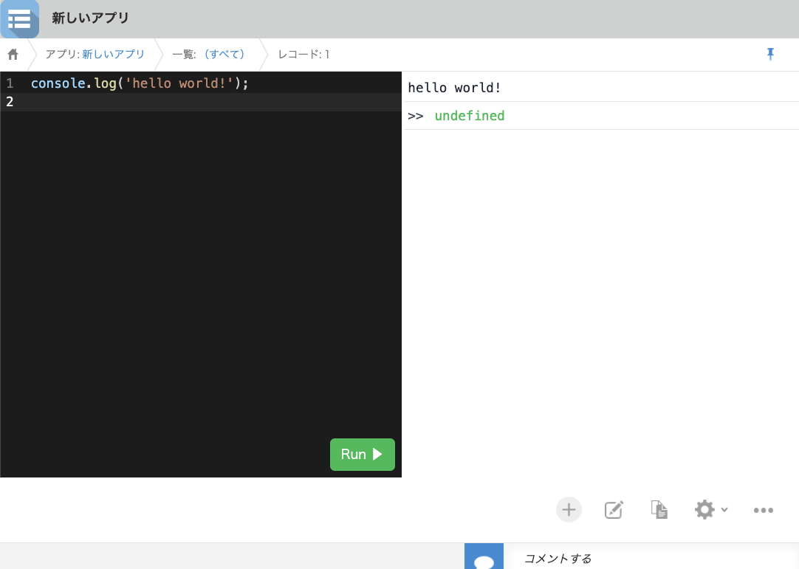

# Experimental New Plugin Sample

This is a sample plugin to test the behavior of experimental new plugin system. Add an editor to the app page and run any code.

## Requirement

- node >= v18.14.0
- npm >= v9.3.1 or pnpm >= v8.10.0

## Hot to use

### Setup

Install dependencies.

```bash
npm i
```

Copy `.env.example` to `.env`.

```bash
cp .env.example .env
```

Edit `.env` file and set your kintone environment.  
These variables are used in upload command. Set upload target kintone url (`KINTONE_BASE_URL`) and user (`KINTONE_USERNAME` and `KINTONE_PASSWORD`) who has permission to upload plugin.

```text
# exmplae
KINTONE_BASE_URL=http://localhost
KINTONE_USERNAME=cybozu
KINTONE_PASSWORD=cyboz
```

### Build and upload plugin

#### Initial Packaging

> [!WARNING]
> This task is for the initial setup. Each time you perform this task, the plugin ID will change. For subsequent times, please follow the instructions under `Packaging from the Second Time Onwards`.

If this is your first time packaging this plugin, you will need to generate a private key file (ppk file) along with the plugin file (plugin.zip).

```bash
npm run build:init
```

Running the above command will generate a ppk file under the `dist/` directory.

Replace the `[YOUR_PLUGIN_KEY_PATH]` part in the `build` command of `package.json` with the path to the ppk file.

```
 "pack": "cli-kintone plugin pack --private-key [YOUR_PLUGIN_KEY_PATH].ppk --output ./dist/plugin.zip --input dist/plugin",
```

#### Packaging from the Second Time Onwards

You only have to execute this command.

```bash
npm run build
```

#### Upload

Upload automation has not yet been implemented. Please upload plugin.zip manually.

See your kintone app setting page and enable the plugin, then you can see code editor in the app record page.



## Development

Setup step is same as above.

### development mode

```bash
npm run dev
```

While the command is running, edit the source code and the plugin will be automatically built and uploaded.

### Lint and Format

```bash
npm run check
```

## License

MIT
